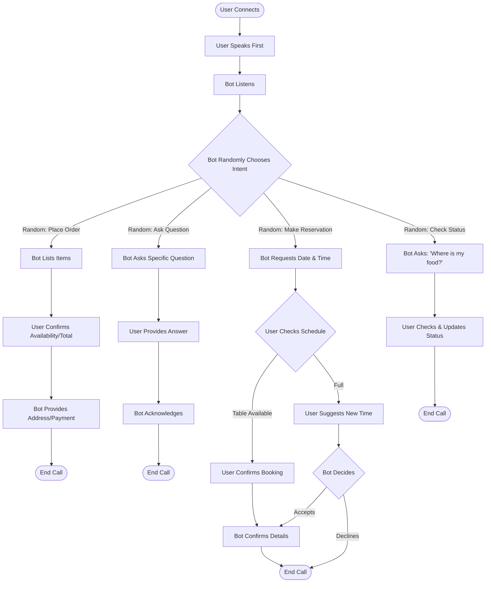

# T6 Restaurant Calling Bot - Flow Diagram

This document describes the conversation flow for the bot calling a restaurant.

**Behavior**: User speaks first, then bot randomly chooses one of 4 intents.

## Flowchart

## Node Structure

### Entry Point: `create_greet_node()`
**Purpose**: Bot waits for user to speak, then randomly chooses an intent  
**Behavior**: User speaks first, bot listens, then randomly selects one function  
**Functions**:
- `place_order` → OrderFlow (random choice)
- `ask_info` → InfoFlow (random choice)
- `make_reservation` → ReservationFlow (random choice)
- `check_status` → StatusFlow (random choice)

### Ordering Flow (4 Nodes)

#### 1. `create_order_node()`
**Purpose**: Bot lists items they want to order  
**Functions**:
- `confirm_order` → Proceeds to confirmation

#### 2. `create_order_confirmation_node()`
**Purpose**: Wait for restaurant to confirm availability and provide total  
**Functions**:
- `get_details` → Proceeds to details

#### 3. `create_order_details_node()` [Terminal]
**Purpose**: Restaurant provides delivery address and payment info  
**Output**: End conversation

---

### Information Query Flow (2 Nodes)

#### 1. `create_info_node()`
**Purpose**: Bot asks specific question about menu/services  
**Functions**:
- `ask_question` → Proceeds to response

#### 2. `create_info_response_node()` [Terminal]
**Purpose**: Listen and acknowledge restaurant's answer  
**Output**: End conversation

---

### Reservation Flow (7 Nodes)

#### 1. `create_reservation_node()`
**Purpose**: Bot requests table with date, time, and party size  
**Functions**:
- `request_booking` → Proceeds to availability check

#### 2. `create_reservation_check_node()`
**Purpose**: Restaurant checks availability  
**Functions**:
- `table_available` → Proceeds to booking confirmation
- `table_not_available` → Proceeds to suggest alternative time

#### 3. `create_reservation_booking_node()`
**Purpose**: Table is available - confirm booking  
**Functions**:
- `confirm_booking` → Proceeds to confirm node

#### 4. `create_reservation_suggest_node()`
**Purpose**: Handle alternative time suggestions  
**Functions**:
- `accept_alternative` → Proceeds to confirm node
- `decline_alternative` → Proceeds to end node

#### 5. `create_reservation_confirm_node()` [Terminal]
**Purpose**: Confirm reservation details and thank restaurant  
**Output**: End conversation

#### 6. `create_reservation_end_node()` [Terminal]
**Purpose**: Reservation declined  
**Output**: End conversation

---

### Order Status Flow (2 Nodes)

#### 1. `create_status_node()`
**Purpose**: Bot asks about current order status  
**Functions**:
- `ask_status` → Proceeds to status update

#### 2. `create_status_update_node()` [Terminal]
**Purpose**: Listen to status update and acknowledge  
**Output**: End conversation

---

## State Management

The bot maintains state in `flow_manager.state` for:

### Order Flow
- `order_items`: Items the customer ordered
- `order_total`: Total price quoted by restaurant

### Info Flow
- `question`: The question asked

### Reservation Flow
- `reservation`: Dictionary containing:
  - `date`: Reservation date
  - `time`: Reservation time
  - `party_size`: Number of people

### Status Flow
- `order_id`: Order ID or reference number

---

## Key Features

✅ **Multi-path Flow**: Customer can choose between 4 different purposes  
✅ **State Persistence**: Information carried through conversation nodes  
✅ **Terminal Nodes**: Clear conversation endpoints with end actions  
✅ **Alternative Paths**: Reservation flow handles availability/unavailability branches  
✅ **Function-based Transitions**: Each node uses FlowsFunctionSchema for transitions  
✅ **Natural Language**: Task messages guide LLM to speak naturally  
✅ **Error Recovery**: Alternative paths when initial request unavailable

